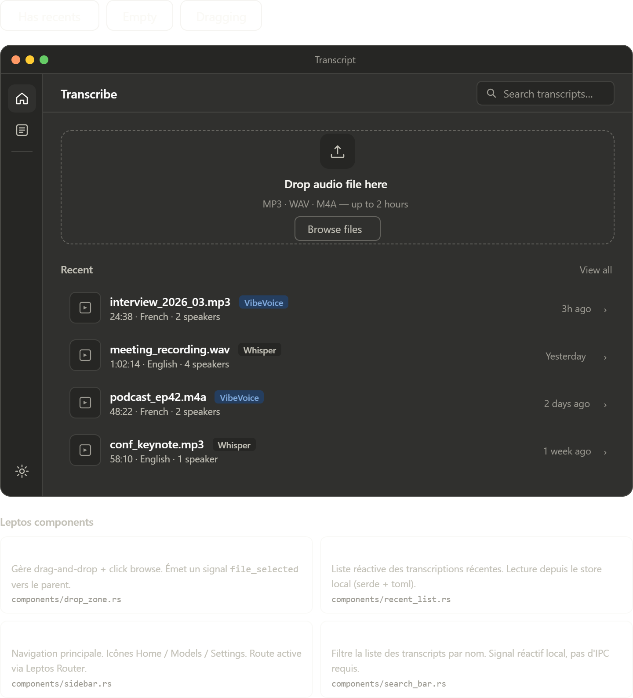
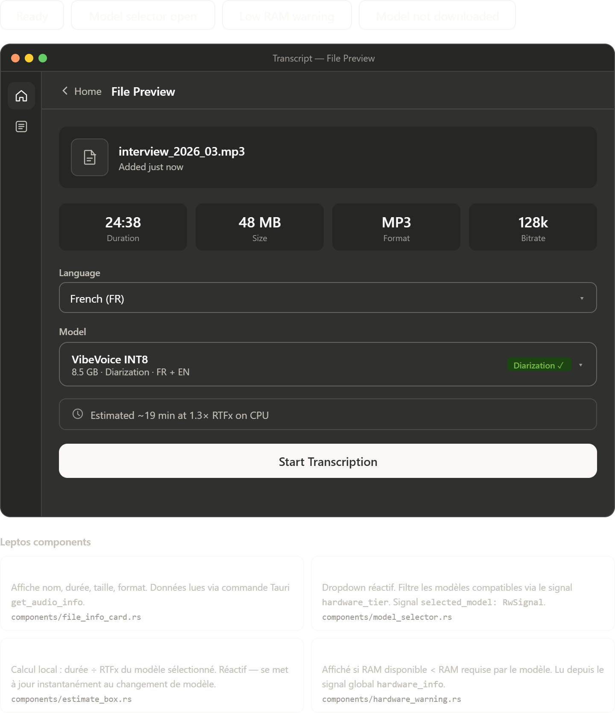

# Home

## Purpose

The Home screen is the app's intake surface. It needs to work equally well for two users:

- a first-time user who only needs a clear place to drop audio
- a returning user who wants to reopen recent work without hunting through folders

## Interactive states

- `Has recents`: the default productivity state with a visible drop zone and a recent transcript list
- `Empty`: the first-run state where the page still feels useful instead of blank
- `Dragging`: the active drop target state that confirms the file can be released here

## Content analysis

- The persistent sidebar is intentionally narrow and icon-based, which keeps navigation stable without pulling attention away from the primary action.
- The drop zone is the visual hero. That is correct because file ingestion is the main job of this screen.
- The search bar only applies to local transcript history. This is a good scope boundary because users expect instant filtering here, not network-backed search.
- Recent items include duration, language, speaker count, and model family. Those fields are the minimum metadata needed to decide whether a transcript is the right one.
- Showing model badges directly in recents is useful because it quietly teaches the difference between Whisper-based and diarization-capable results.

## Implementation notes

- `Sidebar` should remain route-driven and reflect the active path rather than local component state.
- `DropZone` can use local `RwSignal<bool>` drag state, with `on:dragover`, `on:dragleave`, and `on:drop`.
- `RecentList` should be hydrated from a local index file or app store, not fetched remotely.
- `SearchBar` should filter in memory and debounce only if the list becomes large.

## Improvements worth keeping

- Hide the browse button during drag-over. That removes competing actions at the exact moment the user needs confirmation.
- Keep the empty state below the drop zone instead of replacing it. The upload action should remain visually dominant in every state.
- Preserve relative timestamps such as "3h ago", but store absolute timestamps in data so future sorting and locale formatting stay correct.

## Suggested component split

- `Sidebar`
- `DropZone`
- `SearchBar`
- `RecentList`
- `RecentListItem`

## Browser preview

- `transcript_home_screen.html`: quick browser preview of the Home route, including recents, empty, and dragging states

## File Preview

## Purpose

File Preview is the commitment screen between file selection and long-running work. It should answer one question clearly: "Can I start this transcription with confidence?"

## Interactive states

- `Ready`: file metadata is visible and the selected model can run immediately
- `Model selector open`: alternate models are exposed with capability and readiness cues
- `Low RAM warning`: the chosen model is technically available but risky for current hardware
- `Model not downloaded`: the user can see the preferred model but cannot start until it exists locally

## Content analysis

- The file summary card establishes context quickly and confirms the correct asset was selected.
- Four file metrics are shown: duration, size, format, and bitrate. This is better than a plain filename because it helps users catch bad inputs early.
- Language selection appears before model selection. That ordering is sensible because language is a file property, while model choice is a processing strategy.
- The model panel combines capability, weight, and readiness into one control. That prevents the user from hopping across multiple panels to answer a single decision.
- The estimate box turns model choice into an understandable cost. Runtime estimation is a strong UX feature for local inference apps.

## Implementation notes

- `FileInfoCard` can be backed by a single Tauri command such as `get_audio_info`.
- `ModelSelector` should own only selection UI. Compatibility and download status should come from shared model registry state.
- `EstimateBox` can remain purely derived frontend state: `audio_duration / model_rtfx`.
- `HardwareWarning` should key off globally loaded `hardware_info` so every screen evaluates model fit the same way.

## UX safeguards

- Disable `Start Transcription` when the chosen model is missing locally.
- Keep the missing-model warning adjacent to the CTA so the reason for the disabled state is obvious.
- Recommend fallback models in the low-RAM state rather than only showing failure language.
- Preserve the diarization badge next to the selected model. That is a high-value differentiator, not secondary metadata.

## Suggested component split

- `FileInfoCard`
- `LanguageSelect`
- `ModelSelector`
- `EstimateBox`
- `HardwareWarning`
- `StartTranscriptionButton`

## Browser preview

- `transcript_file_preview_screen.html`: quick browser preview of File Preview, including ready, expanded model list, low-RAM, and missing-model states
