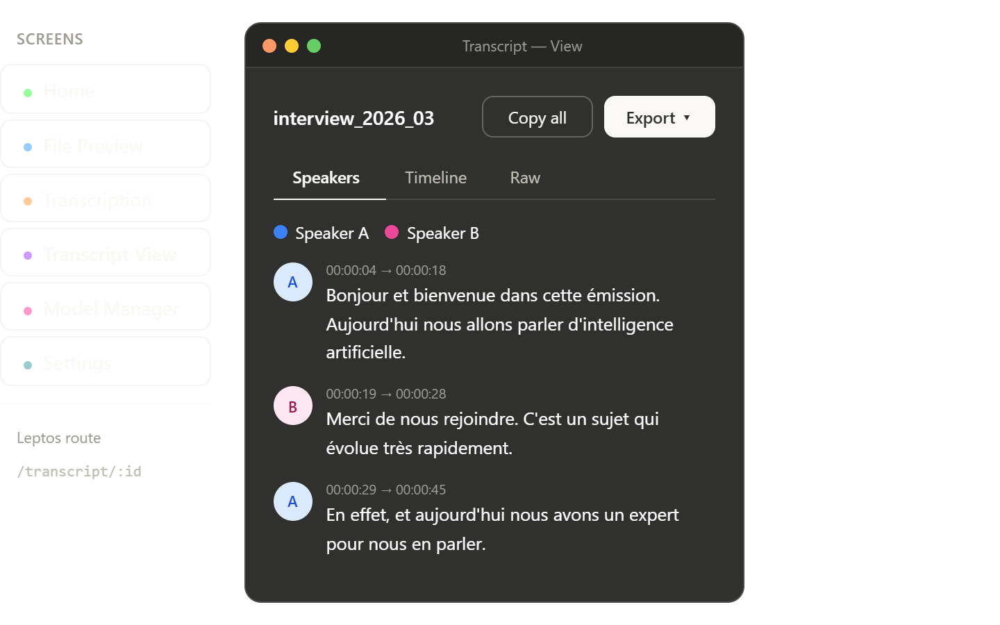

# UI Wireframes

This folder documents the six core application screens used by the desktop transcription flow. Each screen maps to a dedicated Leptos route or a clearly scoped in-page section, and each wireframe already encodes both UX intent and implementation constraints.

## Screen map

| Screen | Route | Primary job |
| --- | --- | --- |
| Home | `/` | Ingest a new audio file and reopen recent transcripts |
| File Preview | `/preview` | Validate file metadata, choose language and model, and surface readiness issues before starting |
| Transcription | `/transcription` | Show live progress, speaker activity, and completion status |
| Transcript View | `/transcript/:id` | Read, filter, copy, and export the final transcript |
| Model Manager | `/models` | Inspect local model availability, storage usage, and downloads |
| Settings | `/settings` | Configure defaults, export behavior, privacy controls, and app metadata |

## Shared design decisions

- The app is offline-first. Audio processing, transcript filtering, and most derived UI state stay local.
- The left sidebar is persistent across the app and anchors the three global destinations: Home, Models, and Settings.
- Every screen exposes explicit states instead of hiding complexity. Low RAM, missing model assets, active downloads, and export limitations are all visible in the UI.
- Model capability is a first-class concept. Diarization support, hardware fit, and expected runtime are shown before the user commits to a transcription.
- The interface favors progressive disclosure. Advanced detail appears near the moment it matters instead of front-loading the whole system.

## Content analysis

- Home reduces friction by combining a large drop target with a recent history list. That makes both first-run and repeat workflows visible on the first screen.
- File Preview acts as the decision checkpoint. This is the right place to attach file metadata, compatibility warnings, and time estimates because the user still has low switching cost.
- Transcription emphasizes trust. Real-time progress, live segments, and a speed indicator help the user understand that work is advancing and how long it will take.
- Transcript View separates reading modes by intent: conversational review, chronological inspection, and raw export-oriented text.
- Model Manager makes hardware and storage tradeoffs legible, which is critical for large local models.
- Settings stays operational rather than decorative. Every section either changes runtime defaults, export output, privacy behavior, or support/debug visibility.

## Recommended documentation standard

Each per-screen `index.md` in this folder should answer the same questions:

- What the screen is for.
- Which user states exist.
- Which UI blocks carry the most important information.
- Which parts are local UI state versus Tauri or Leptos-backed state.
- Which UX safeguards prevent avoidable errors.

## Detailed docs

- [Home and File Preview](./home/index.md)
- [Transcription](./transcription/index.md)
- [Transcript View](./transcript/index.md)
- [Model Manager](./model_manager/index.md)
- [Settings](./settings/index.md)

## Browser previews

These HTML files are useful as quick implementation overviews because they can be opened directly in a browser without running the app:

| Preview | File | Notes |
| --- | --- | --- |
| Full six-screen overview | `transcript_wireframes_poc.html` | One-page navigator covering all primary routes |
| Home | `home/transcript_home_screen.html` | Home states: recents, empty, dragging |
| File Preview | `home/transcript_file_preview_screen.html` | Preview states: ready, model list, low RAM, missing model |
| Transcription | `transcription/transcript_transcription_screen.html` | Loading, running, almost done, complete |
| Transcript View | `transcript/transcript_view_screen.html` | Speakers, timeline, raw, export overlay |
| Model Manager | `model_manager/transcript_model_manager_screen.html` | Default, downloading, ready |
| Settings | `settings/transcript_settings_screen.html` | Section navigation and interactive settings rows |

Use the HTML previews for rapid UI review, and use the markdown docs for intent, architecture, and UX rationale.
