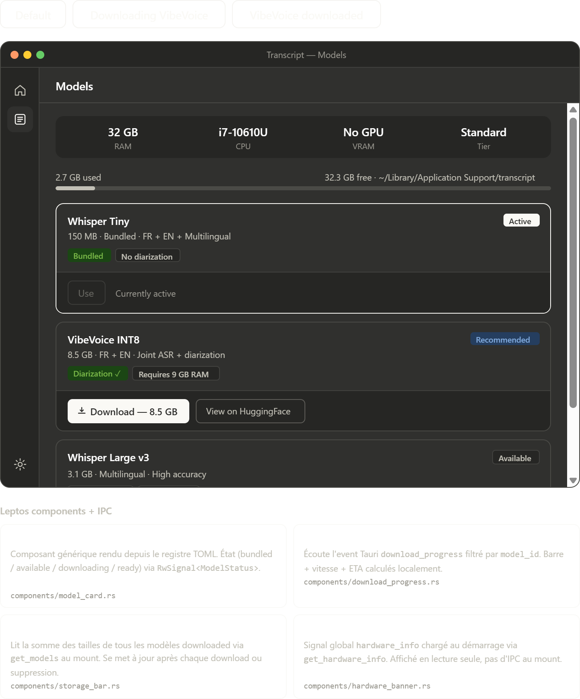

# Model Manager

## Purpose

Model Manager is where the user understands capability, cost, and local storage impact before switching transcription engines. It should make heavyweight model operations feel controlled rather than risky.

## Interactive states

- `Default`: baseline catalog state with one active model and other models available to download
- `Downloading VibeVoice`: inline progress state with transfer feedback tied to a specific model card
- `VibeVoice downloaded`: post-download state where the model becomes available or active without a page reload

## Content analysis

- The hardware banner is correctly placed at the top because it frames every downstream decision on the page.
- Storage usage is summarized before the model list. That prevents surprise once the user starts large downloads.
- Each model card exposes size, language scope, diarization support, and state badges. Those are the exact fields users need to compare practical value.
- Inline download progress is better than a detached global modal because the action belongs to a specific model.
- The active model styling is important. Without it, "downloaded" and "currently in use" would blur together.

## Implementation notes

- `HardwareBanner` should read from globally cached `hardware_info` loaded at app startup.
- `ModelCard` should be rendered from a model registry file so availability, labels, and requirements stay data-driven.
- `DownloadProgress` should subscribe only to events for its own `model_id`.
- `StorageBar` should recompute after successful download, activation, or deletion.

## UX safeguards

- Do not expose `Delete` for the active model.
- Keep the storage path visible so users understand that model files are local and inspectable.
- A recommended badge should reflect actual hardware fit, not a static product preference.
- If a model is downloading, the primary action should become cancel or pause, not remain a misleading download button.

## Suggested component split

- `HardwareBanner`
- `StorageBar`
- `ModelCard`
- `DownloadProgress`
- `ModelActionRow`

## Browser preview

- `transcript_model_manager_screen.html`: quick browser preview of hardware, storage, model states, and inline download behavior
