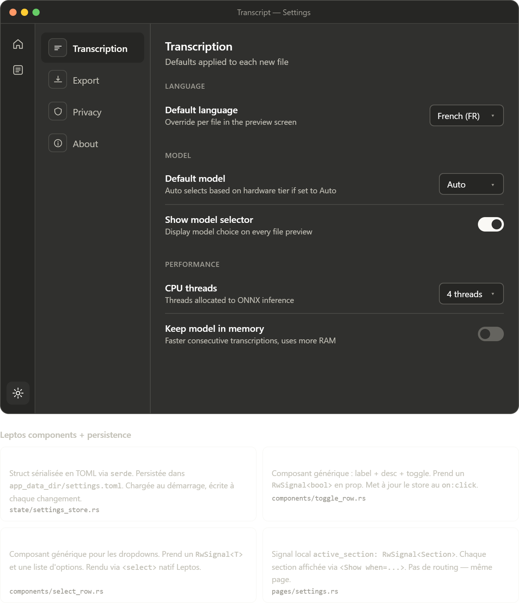

# Settings

## Purpose

Settings is the control surface for app defaults and operational transparency. It should feel stable, low-risk, and easy to scan rather than clever.

## Navigable sections

- `Transcription`
- `Export`
- `Privacy`
- `About`

## Content analysis

- The two-panel layout is the right choice because it keeps section switching fast while preserving context.
- `Transcription` settings focus on runtime defaults such as language, model strategy, and performance. These are high-frequency controls and belong first.
- `Export` groups output location and formatting rules. Keeping these together reduces confusion about what gets saved and where.
- `Privacy` explicitly states that processing is local, then scopes telemetry and update checks separately. That ordering builds trust before asking for opt-in behavior.
- `About` is not filler here. Version tags, dependency information, and external links are useful for debugging, support, and open-source credibility.

## Implementation notes

- Section switching should stay local UI state such as `RwSignal<Section>`, not separate routes.
- `SettingsStore` can be serialized to TOML under `app_data_dir()/settings.toml`.
- Generic rows like `ToggleRow` and `SelectRow` are the correct abstraction if they write directly to the shared store.
- Persist on change, but debounce file writes if toggles can be changed rapidly.

## UX safeguards

- Show descriptive helper text for every setting that can affect output quality, runtime, or privacy.
- Destructive actions such as clearing history should require confirmation and should explain exactly what is removed.
- Privacy wording should be concrete. "No audio leaves your device" is stronger and clearer than a generic privacy promise.
- The About section should surface exact versions so support conversations do not depend on guesswork.

## Suggested component split

- `SettingsSectionNav`
- `ToggleRow`
- `SelectRow`
- `PathRow`
- `AboutCard`
- `SettingsStoreProvider`

## Browser preview

- `transcript_settings_screen.html`: quick browser preview of section switching and interactive settings controls
