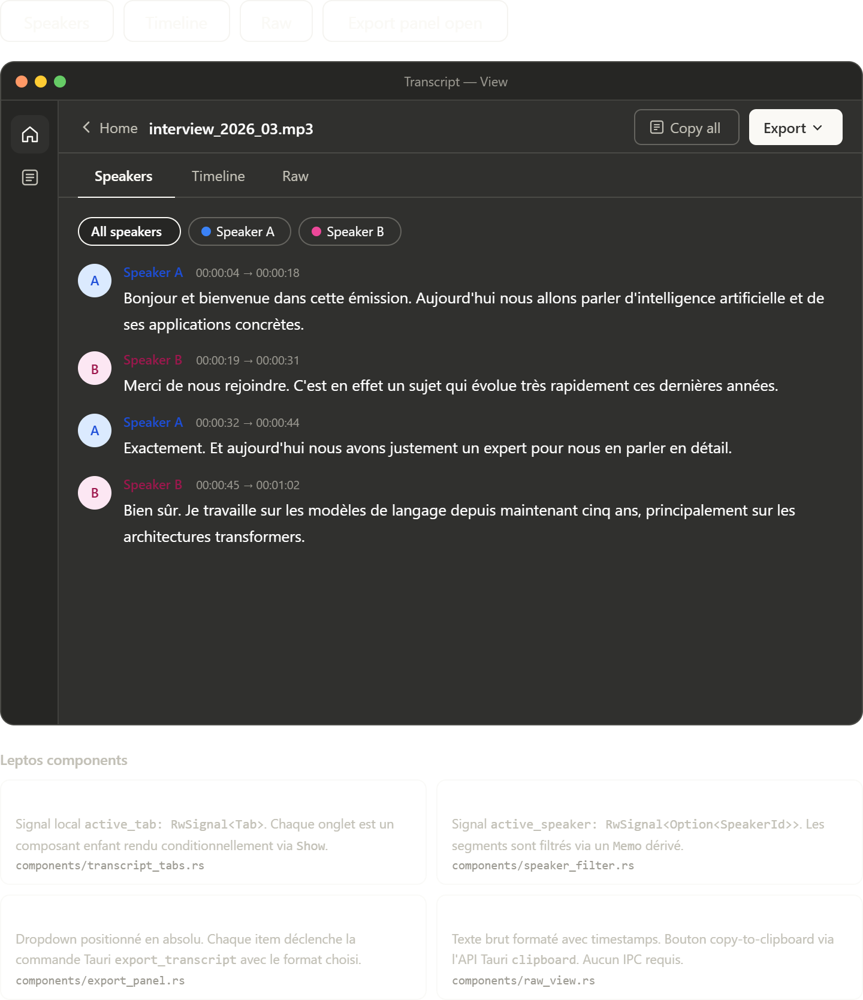

# Transcript View

## Purpose

Transcript View is the post-processing workspace. The transcription is already done; the job now is review, navigation, copying, and export.

## Interactive states

- `Speakers`: the default reading mode with speaker grouping and optional speaker filtering
- `Timeline`: the chronological inspection mode optimized for scanning sequence and handoff points
- `Raw`: the copy-oriented text mode with timestamps preserved inline
- `Export panel open`: the action state where file format choices are presented without leaving the screen

## Content analysis

- The top bar combines context, quick copy, and export. That is the right hierarchy for a completed asset.
- The three-tab model is justified because each view supports a genuinely different task instead of merely restyling the same layout.
- Speaker chips are an efficient filter affordance. They avoid dropdown friction and make multi-speaker review faster.
- Timeline view is especially useful for QA because it makes turn order, pacing, and clustering visible at a glance.
- Raw view is intentionally plain. That is correct, because this tab is for transferability and auditing rather than presentation polish.
- Showing DOCX as disabled is acceptable if it is clearly labeled as future work, not a broken action.

## Implementation notes

- `TranscriptTabs` should own only active tab state.
- `SpeakerFilter` should derive filtered segments from in-memory transcript data through a `Memo`.
- `ExportPanel` can remain an anchored overlay tied to the trigger button.
- `RawView` should support one-click copy without reformatting source transcript data.

## UX safeguards

- Timestamps should be clickable in the richer views even if playback is not implemented yet; they signal structure and future extensibility.
- The active export action should close after success or explicit dismissal, not remain open ambiguously.
- Copy and export labels should stay format-specific so users know whether timestamps and speaker labels are included.
- Filtering should never mutate the underlying transcript data. It should only affect view output.

## Suggested component split

- `TranscriptTabs`
- `SpeakerFilter`
- `TranscriptSegmentList`
- `TimelineView`
- `RawView`
- `ExportPanel`

## Browser preview

- `transcript_view_screen.html`: quick browser preview of transcript reading, filtering, and export interactions
