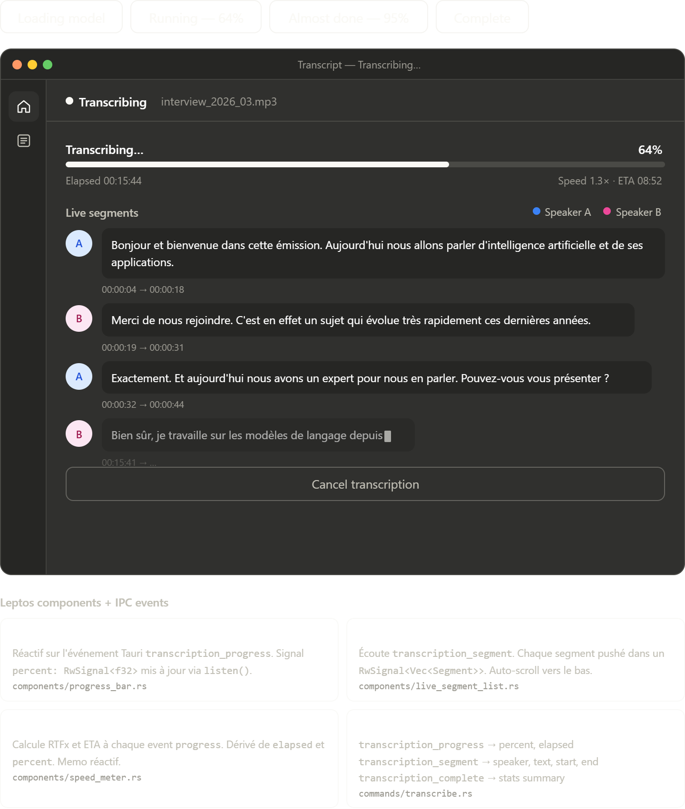

# Transcription

## Purpose

This screen exists to maintain user trust during the longest operation in the app. It should make progress legible, expose partial results early, and avoid the feeling that the app has frozen.

## Interactive states

- `Loading model`: the inference runtime is warming up and no transcript text is available yet
- `Running 64%`: the normal in-progress state with live segments and continuously updating progress
- `Almost done 95%`: the late-stage state where ETA becomes more important than raw progress
- `Complete`: processing is finished and the user is ready to move into reading and export

## Content analysis

- The top status row uses both text and a live indicator. That is stronger than a spinner alone because it communicates what the app is doing, not just that it is busy.
- Progress is expressed as percentage, elapsed time, speed, and ETA. These metrics complement each other well: percentage reassures, elapsed time grounds the session, and ETA supports planning.
- Live segments are the most valuable content block on this page. They transform the screen from a processing monitor into a usable preview.
- Speaker color coding is lightweight and effective. It helps users validate diarization quality without adding a heavy legend or chart.
- The final state includes a compact summary card before navigation. That is a good checkpoint because it confirms results and closes the loop on runtime expectations.

## Event and state model

- Rust emits `transcription_progress`, `transcription_segment`, and `transcription_complete`.
- Leptos listens once, then updates screen state through signals instead of full rerenders.
- `SpeedMeter` should remain derived UI state based on `percent`, `elapsed`, and total duration.
- `LiveSegmentList` should append incrementally and auto-scroll only if the user is already near the bottom.

## UX safeguards

- Keep a distinct `Loading model` state. Startup latency should never look like a stalled transcription.
- Show the currently active partial segment with a cursor or reduced-opacity bubble so users understand why the latest line is unfinished.
- Leave `Cancel transcription` available during active processing, but require confirmation if partial transcript data would be lost.
- On completion, do not immediately hard-jump away without giving the user a visible success state first.

## Suggested component split

- `ProgressBar`
- `SpeedMeter`
- `LiveSegmentList`
- `LiveSegmentItem`
- `TranscriptionSummary`
- `CancelTranscriptionButton`

## Browser preview

- `transcript_transcription_screen.html`: quick browser preview of the transcription flow, including loading, in-progress, late-stage, and complete states
